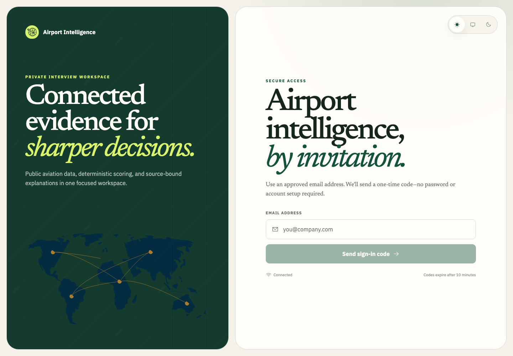
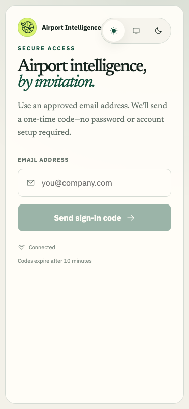
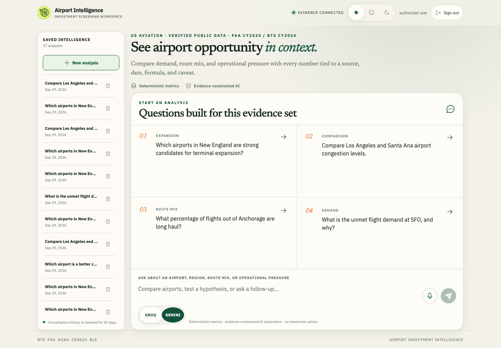
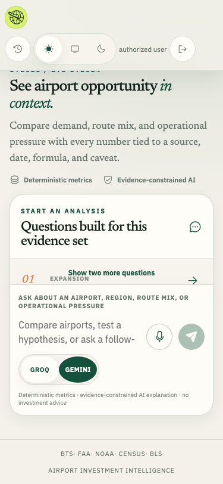
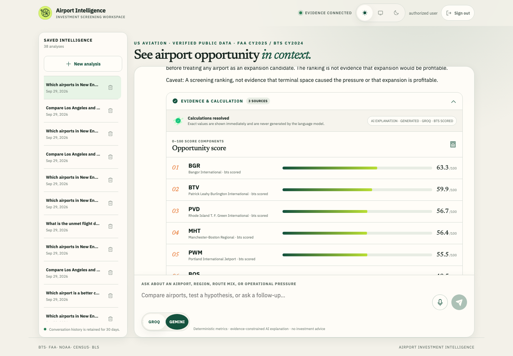
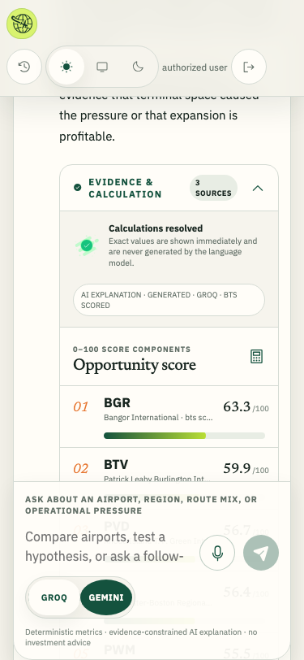
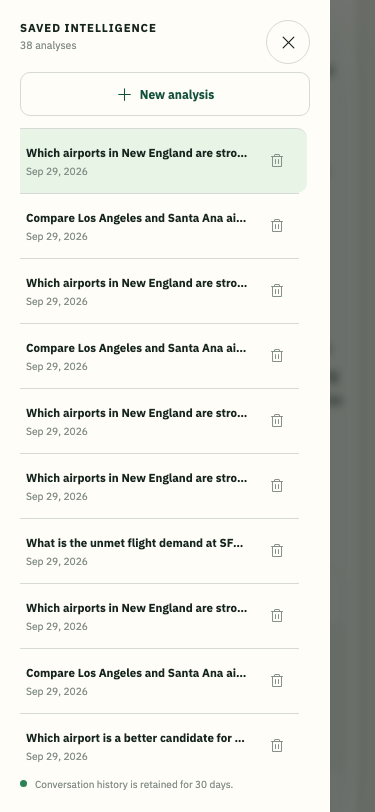

# Airport Investment Intelligence

Interview-ready airport opportunity screening in **one repository**, deployed as **two services**, with **Supabase** for auth and Postgres.

```text
web/   Next.js UI  →  Vercel
         Bearer JWT
api/   FastAPI     →  Render or Railway
         ├── deterministic 0–100 scores from checked-in evidence
         ├── FAA / NOAA / Census / BLS context (never changes the score)
         └── Groq or Gemini evidence-constrained explanations
supabase  Auth OTP + Postgres  (not an app host)
```

Supabase does not run Next.js or FastAPI. It issues sessions and stores `app_users`, conversations, and the catalog snapshot.

## Start locally

1. API: `cd api && python3 -m venv .venv && source .venv/bin/activate && pip install -r requirements-dev.txt && cp .env.example .env && alembic upgrade head && uvicorn app.main:app --reload`
2. Web: `cd web && npm ci && cp .env.example .env.local && npm run dev`
3. Open **http://localhost:3000**. For OTP, configure Supabase SMTP and an ignored `api/allowlist.json`, then `airport-admin sync-users --file allowlist.json`.

Optional Docker parity: `docker compose up --build` (needs `api/.env` and public Supabase values as compose build args).

Each app keeps its own tests, Dockerfile, and contribution docs. Path-filtered CI lives in [`.github/workflows/ci.yml`](.github/workflows/ci.yml).

## Interface

<p>
  
  
</p>
<p>
  
  
</p>
<p>
  
  
</p>
<p>
  
</p>

## Deployment

1. **Supabase:** disable public signup, custom SMTP, Site URL and Redirect URLs = the Vercel origin. Keep `allowlist.json` uncommitted. Apply `alembic upgrade head`, `airport-admin seed-catalog`, and `airport-admin sync-users`.
2. **API (Render or Railway):** Docker context `api/`, [`render.yaml`](render.yaml) as a starting blueprint. Production requires `ENVIRONMENT=production`, `AUTH_REQUIRED=true`, pooled `DATABASE_URL`, exact `CORS_ORIGINS=https://<vercel-host>` (no localhost), `SUPABASE_URL`, and LLM keys. Optional `CENSUS_API_KEY` / `BLS_API_KEY`.
3. **Web (Vercel):** Root Directory `web`. Set `NEXT_PUBLIC_API_BASE_URL` to the public API URL, plus `NEXT_PUBLIC_SUPABASE_URL` and the anon/publishable key only. Never put a service-role, database, SMTP, or Groq key in Vercel `NEXT_PUBLIC_*` variables.
4. Confirm `/health`, `/ready`, OTP sign-in, authenticated ranking, history ownership/deletion, and sign-out.

No committed file should contain a real interviewer address or credential.
